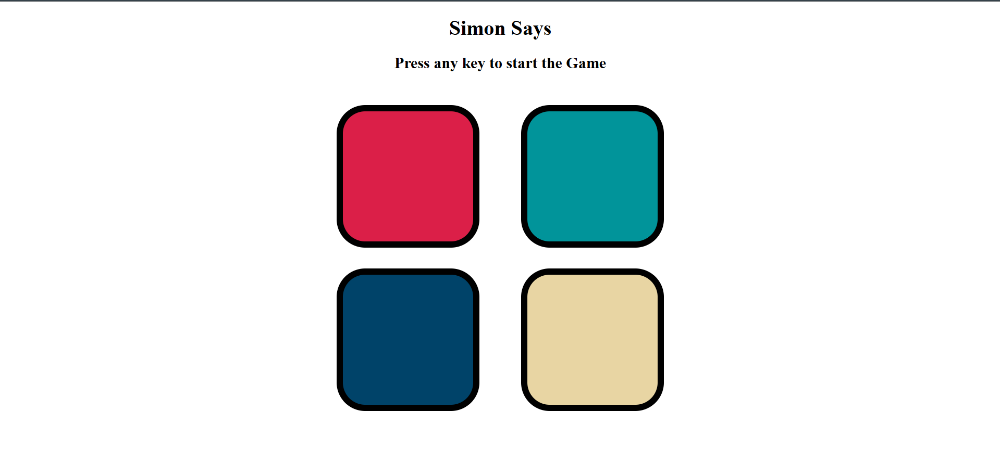
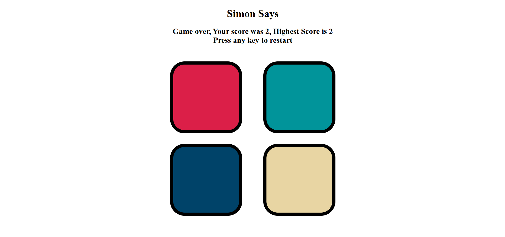

# Simon Says Game 🎮

A fun and interactive "Simon Says" memory game built using HTML, CSS, and JavaScript.

## 🕹️ Game Rules

- The game shows a sequence of colors.
- Your task is to repeat the same sequence by clicking the color buttons.
- With every correct input, the sequence gets longer.
- A wrong click ends the game and you can restart.

## 🚀 Tech Stack

- **HTML5**
- **CSS3**
- **JavaScript**

## 📂 How to Run

1. Clone the repo:
git clone https://github.com/Manish-Baviskar/Simon-Says-Game.git

2. Open `index.html` in your browser and start playing!

## 📸 Screenshots

Here are some previews of the game:

### 🟢 Game Start

### 🔴 Game Over Screen

---

Enjoy playing the game! 😊
